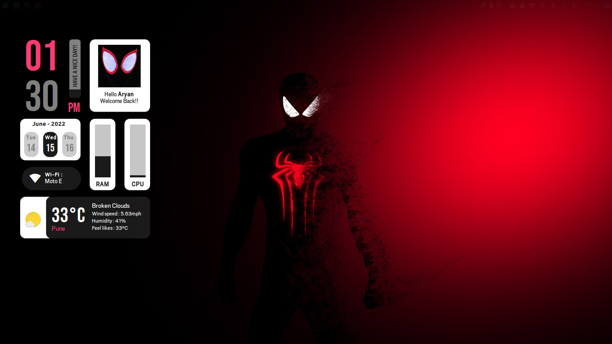
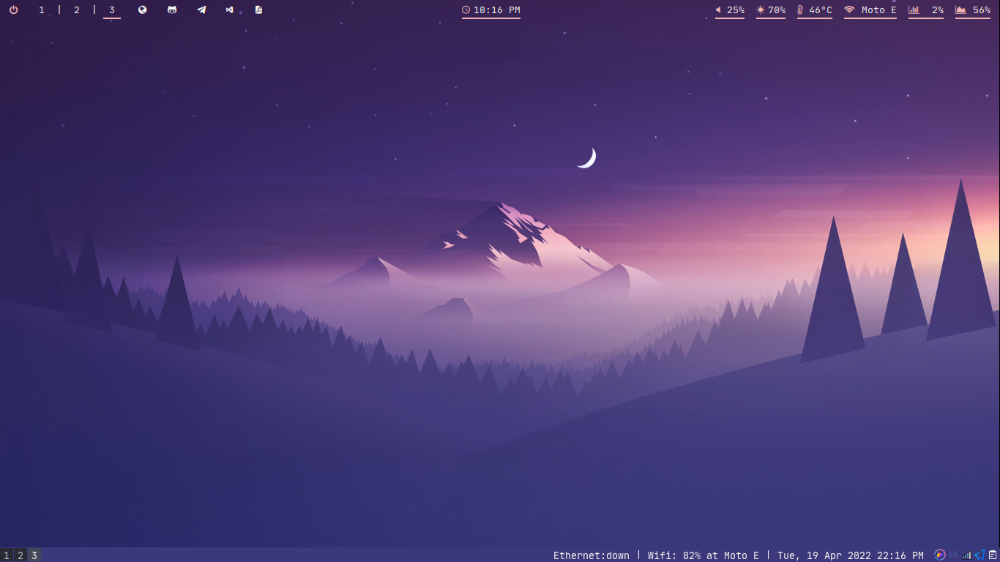
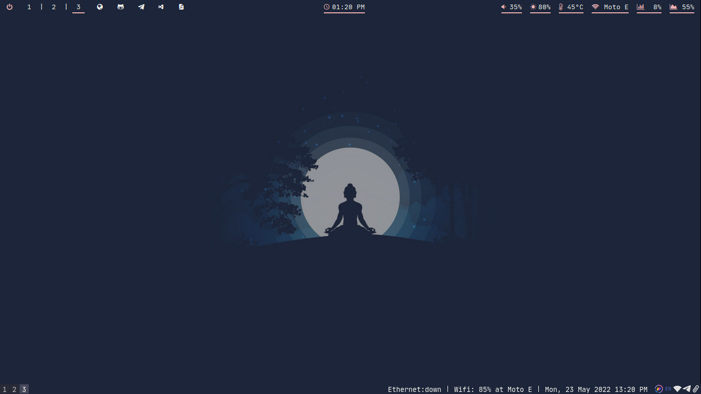

## BSPWM Dotfiles

  #### I dont use Arch btw :)

## Overview

- **Operating System** : [**`Linux Mint`**](https://linuxmint.com/)
- **Window Manager** : [**`i3-gaps`**](https://github.com/Airblader/i3) [**`bspwm`**](https://github.com/baskerville/bspwm)
- **Status Bar** : [**`Polybar`**](https://github.com/polybar/polybar)
- **Launcher** : [**`Rofi`**](https://github.com/davatorium/rofi)
- **Notifications** : [**`Dunst`**](https://github.com/dunst-project/dunst)
- **Tray** : [**`Tint2`**](https://gitlab.com/o9000/tint2)
- **Lockscreen** : [**`betterlockscreen`**](https://github.com/betterlockscreen/betterlockscreen) [**`i3lock-color`**](https://github.com/Raymo111/i3lock-color)
- **Compositor** : [**`picom`**](https://github.com/pijulius/picom)
- **Terminal** : `xfce4-terminal`
- **File Manager** : `Thunar`
- **Text Editor** : `Visual Studio Code,xed,vim`
- **Web Browser** : `Brave`
- **Music player** : `spotify,ncmpcpp`

### Fonts :

  - [**Fira Code**](https://github.com/tonsky/FiraCode)
  - [**Jetbrains Mono**](https://github.com/JetBrains/JetBrainsMono)

  ### Glyph Fonts :
  
   - [**Font Awesome**](https://fontawesome.com/download)
     - [Cheat Sheet](https://fontawesome.com/v5/cheatsheet/free/)
   - [**Nerd Fonts**](https://www.nerdfonts.com/)
     - [Cheat Sheet](https://www.nerdfonts.com/cheat-sheet)

## Showcase :

  ### xfce :
  
  
  ### i3-gaps :
  
  
  

#### References
- [Archcraft](https://github.com/archcraft-os)
- [adi1090x](https://github.com/adi1090x)
- [Syndrizzle](https://github.com/Syndrizzle/hotfiles)
