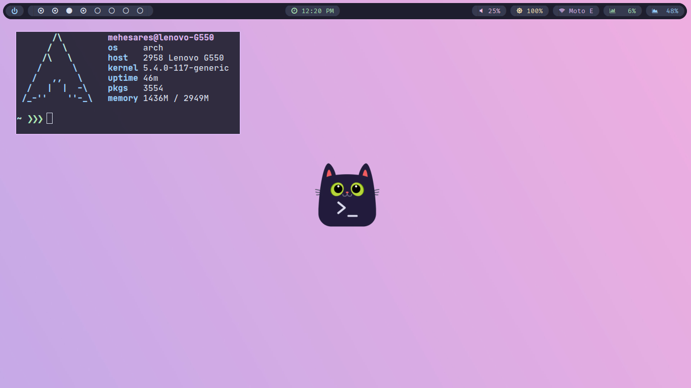
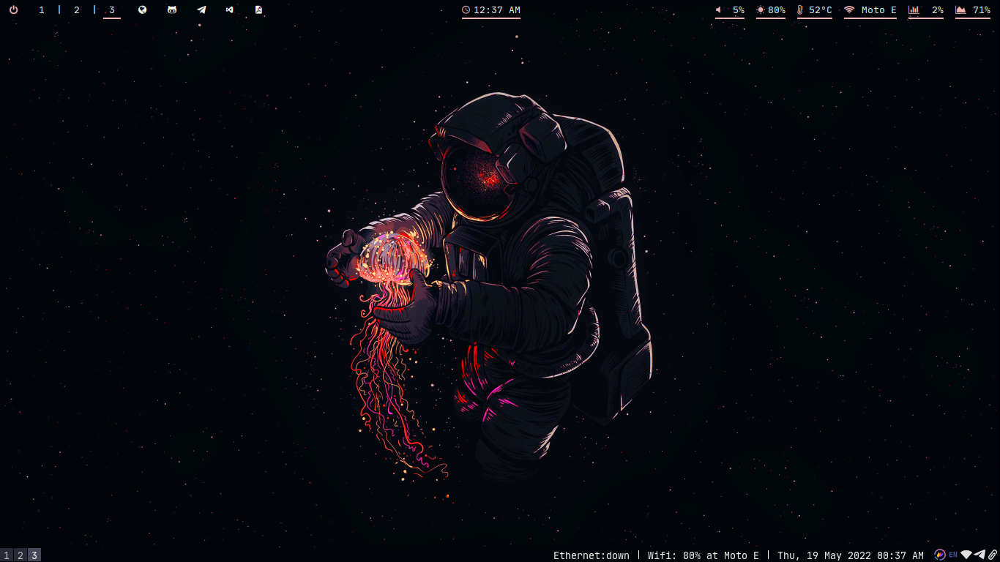

## My dotfiles config.

### Configs included for :

  - i3 - https://github.com/i3/i3
    - i3-gaps - https://github.com/Airblader/i3
  - bspwm - https://github.com/baskerville/bspwm
  - sxhkd - https://github.com/baskerville/sxhkd
  - rofi - https://github.com/davatorium/rofi
  - cava - https://github.com/karlstav/cava
  - vis - https://github.com/dpayne/cli-visualizer
  - ranger - https://github.com/ranger/ranger
  - polybar - https://github.com/polybar/polybar
  - compton - https://github.com/chjj/compton
  - picom - https://github.com/yshui/picom
    - picom-jonaburg - https://github.com/jonaburg/picom
  - redshift - https://github.com/jonls/redshift
  - neofetch - https://github.com/dylanaraps/neofetch
  - starship prompt - https://starship.rs/
  - dunst - https://github.com/dunst-project/dunst
  - ncmpcpp - https://github.com/ncmpcpp/ncmpcpp
  - mpd

### Fonts :

  - Fira Code - https://github.com/tonsky/FiraCode
  - Jetbrains Mono - https://github.com/JetBrains/JetBrainsMono
  - Hack - https://github.com/source-foundry/Hack

  ### Glyph Fonts :
  
   - Font Awesome - https://fontawesome.com/download
     - Cheat Sheet - https://fontawesome.com/icons
   - Nerd Fonts - https://www.nerdfonts.com/
     - Cheat Sheet - https://www.nerdfonts.com/cheat-sheet

## My Desktops :

  ### bspwm :
  
  I dont use Arch btw :)
  
  ### xfce :
  
  
  ### i3 :
  
